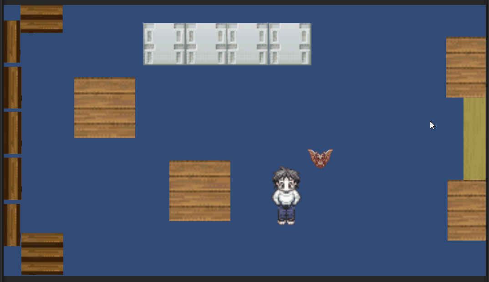

# Introducción a la programación de juegos 2D. Físicas
---
**Demostración:**
1. Los bloques están sujetos a física.
2. El murciélago está encadenado a el personaje.
3. La zona amarilla derecha del todo es una zona de efecto (empuje).

